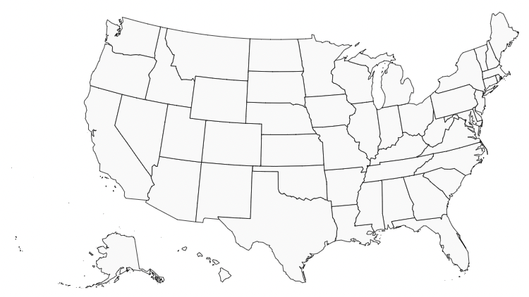

# Welcome to react-simple-maps

This is an open source project that aims to provide simple and easy to use maps for React.



We plan to add more features in the future. In the meantime if you are interested in contributing to this project, please feel free to fork the repository and make a pull request. We are looking forward to your contribution. There will be a lot more countries added to the project in the future.

# For developers

Each project in the packages folder is an npm package.

How to run a project:

```
cd packages/<project>
```

install:

    ```
    npm i
    ```

start:

    ```
    npm run start
    ```

The project will be served on port 3000. Each project has a demo folder which can be used to see how the project works.

### Credit

I would like to thank [simple maps](https://simplemaps.com/resources/svg-maps) for the open source SVG maps.
